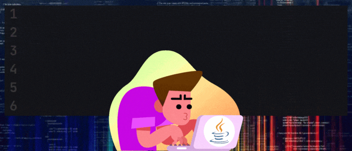

<!--

  

-->
<h1 align="center">Hi 👋, I'm Gabriel Gramajo</h1>
<h3 align="center">Technology is my passion and vocation 🤓. My favorite area is Computer Networks and Cloud Computing.</h3>

<h2 align="left">About me:</h2>

- 🤓 I am an **AWS ReStart** graduate and an **AWS Certified Cloud Practitioner**. 

- 👨‍💻 All my digital badges in Credly [my profile](https://www.credly.com/users/gabriel-omar-gramajo)

- 👨‍🎓 Formal education: **I'm currently studying a Tecnicatura Universitaria en Redes Informáticas at the Universidad Nacional del Oeste.** 

<h3 align="left">Connect with me:</h3>

<h3 align="left">Languages and Tools:</h3>

 
<!--    
   
   
   
   -->
   
   
   
  
  
  <!----> 

